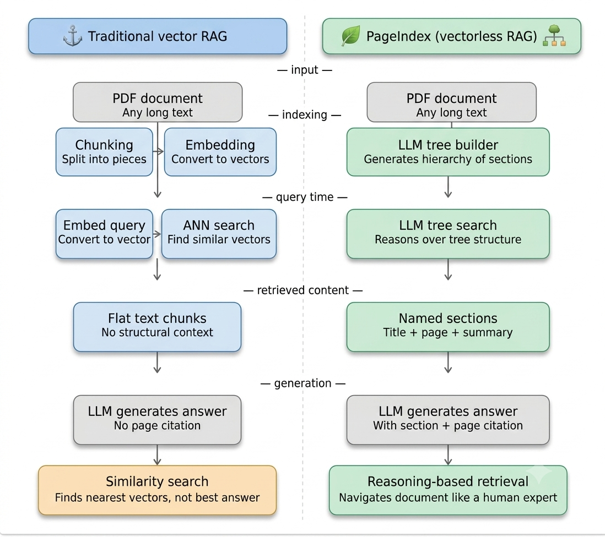
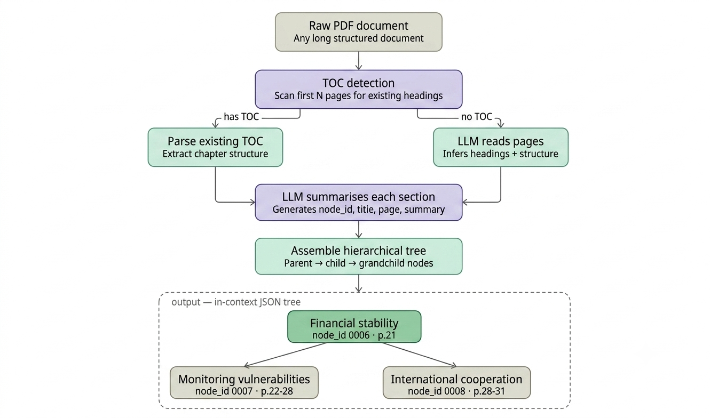
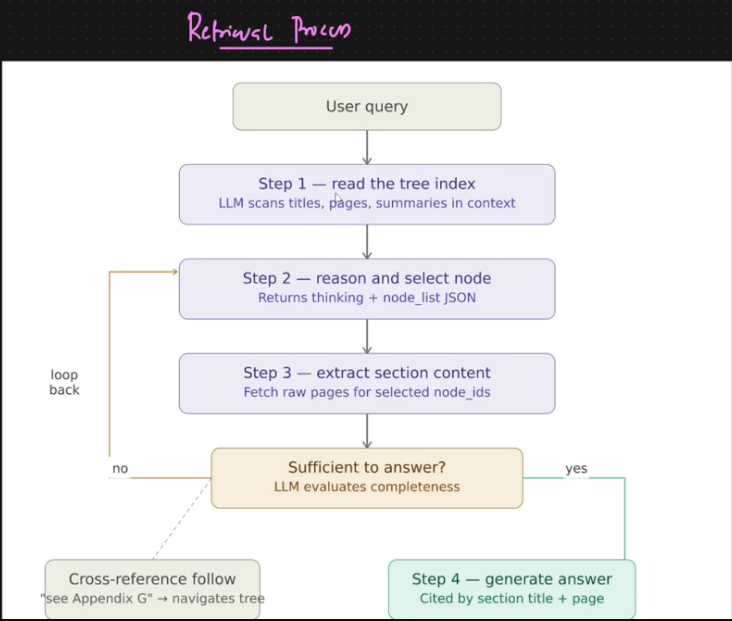

# PageIndex (Vectorless RAG)

A novel approach to document search and retrieval using hierarchical tree structures built by Large Language Models, enabling precise, page-cited answers without relying on similarity search in vector databases.

---

## ⚖️ Traditional Vector RAG vs. PageIndex (Vectorless RAG)

### What is this diagram showing?
This image compares two different ways an AI can search through a massive document to answer a user's question. On the left is the older, standard method (**Traditional Vector RAG**), and on the right is a newer, smarter approach (**PageIndex / Vectorless RAG**).

---

### How the Flow Works (Step-by-Step)

#### 📥 The Input
Both systems start with the same thing—a long PDF document (like a 100-page financial report) and a user asking a question.

#### 🧠 The Indexing & Storage (The "Brain" Setup)
* **Traditional RAG (Left):** It takes the PDF, chops it into random, equal-sized pieces (Chunking), and turns those pieces into math formulas (Embeddings). It saves these in a Vector Database. Think of this like cutting a book into random paragraphs and scattering them in a box.
* **PageIndex (Right):** Instead of chopping it up randomly, an LLM acts like a human reader. It scans the document and builds an organized table of contents (LLM tree builder) saved as a JSON tree index. No complex math database is needed.

#### 🔍 Retrieval (Finding the Answer)
* **Traditional RAG:** When you ask a question, it converts your question into math and looks for chunks with similar math formulas (ANN search). It pulls out Flat text chunks but has no idea where they came from or what the surrounding pages say.
* **PageIndex:** When you ask a question, the LLM looks at the table of contents tree it built (LLM tree search). It logically reasons: *"Ah, this question is about international laws, so I should look under Section 4, Page 28."* It pulls out Named sections with full context.

#### 📤 The Output
* **Traditional RAG** gives you a raw answer but cannot tell you exactly what page it found it on because the structural context was lost. It relies on similarity search (what looks closest, not necessarily what is right).
* **PageIndex** gives you a precise answer complete with page and section citations. It relies on reasoning-based retrieval (navigating like a human expert).

---

## 🏗️ Inside the PageIndex Tree Builder Workflow

### What is this diagram showing?
This image zooms into the right side of the first diagram. It explains exactly how the AI acts like a human librarian to build that smart, organized map (the JSON tree index) out of a raw PDF.

---

### How the Flow Works (Step-by-Step)

* **Raw PDF Document:** You give the system a long, structured document.
* **TOC (Table of Contents) Detection:** The AI first scans the top of the document to see if a Table of Contents already exists.
  * **Branch A (Has TOC):** If it finds one, it copies it directly to understand how the chapters are broken down.
  * **Branch B (No TOC):** If there isn't one, an LLM reads through the pages and guesses what the headings and structure should be based on the text size and layout.
* **Section-Aware Splitting:** Instead of cutting text mid-sentence or mid-paragraph based on a character limit (which traditional RAG does), this system splits the document only where a section naturally ends. It respects logical boundaries.
* **LLM Summarizes Each Section:** The AI reads every individual section and creates a mini ID card for it, including a unique `node_id`, the title, the exact page number, and a short summary of what that section is about.
* **Assemble Hierarchical Tree:** Finally, it links everything together into a family tree structure (`Parent $\rightarrow$ Child $\rightarrow$ Grandchild`).
  * **Example:** As shown in the dotted box, *"Financial Stability"* (Page 21) is the parent chapter. Nested directly underneath it are its sub-sections: *"Monitoring vulnerabilities"* (Pages 22–28) and *"International cooperation"* (Pages 28–31).

---

## 🔎 Inside the PageIndex Retrieval Process

### What is this diagram showing?
While the previous diagram showed how the AI builds the document map (the hierarchy tree), this image shows exactly what happens at query time when a user asks a question. It details the step-by-step loop the AI uses to look at that map, pull the right pages, and double-check its own work before giving an answer.

---

### How the Flow Works (Step-by-Step)

* **User Query:** The process triggers when a user submits a question (e.g., *"What were the international cooperation steps taken for financial stability?"*).
* **Step 1 — Read the Tree Index:** Instead of frantically digging through thousands of text chunks, the Large Language Model (LLM) calmly scans the titles, page numbers, and summaries within the document's map (the context tree we built earlier).
* **Step 2 — Reason and Select Node:** The AI logically decides which parts of the map are relevant. It outputs its internal chain of thought (*"thinking"*) along with a specific list of matching section IDs (`node_list` in JSON format).
* **Step 3 — Extract Section Content:** Now that it knows exactly where to go, the system fetches the raw, full-text pages corresponding to those selected `node_ids`.
* **Sufficient to Answer? (The Quality Check):** The LLM stops and reviews what it just gathered. It evaluates whether the retrieved text contains the complete, detailed information needed to answer your question fully.
  * **If YES:** It passes the information to **Step 4 — Generate Answer**, crafting a response explicitly cited by the correct section title and page number.
  * **If NO:** It activates a **Loop Back** and jumps straight back to Step 2 to find more sections it might have missed.
* **Cross-reference follow:** If the pages it read say something like *"see Appendix G for more details,"* the AI is smart enough to navigate across the tree to hunt down that referenced section too.